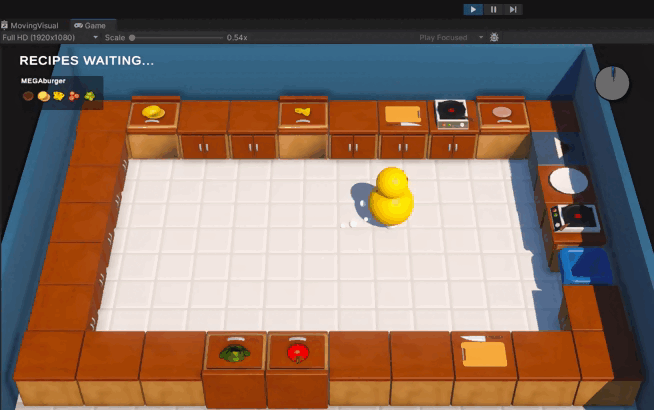

# KitchenChaos
#### Hello there! :wave: Attention :cop: :warning:

This readme has two versions, english and portuguese, if you want to read in portuguese click [HERE](#versão-em-português) or [PORTUGUÊS](#versão-em-português).

There's a lot of comments in the code, I know this is NOT a good clean code practice, however this project is used as a portfolio and as study material, for these reasons I think it is important to place several comments in the code, facilitating learning.

## Objective
This project has the objective to learn and practice game development, Unity, C#, clean code, in addition to use it as part of my portfolio.

## Introduction
This project has been made through the free course "[Learn Unity Beginner/Intermediate 2023(FREE COMPLETE Course - Unity Tutorial)](https://www.youtube.com/watch?v=AmGSEH7QcDg&ab_channel=CodeMonkey)" by [Codemonkey](https://www.youtube.com/@CodeMonkeyUnity). In this course, codemonkey aims to teach you how to do a more complex project, with the main focus on clean code, using more advanced programming practices.

## Application
In the "Kitchen Chaos" project, the player controls a character inside a kitchen, the objective is to make the largest number of dishes ordered by customers within a time limit. The player can move the character and interact with the scenery, there are two interaction options, the first is to pick up/place an object, the second is to cut ingredients. Using these interactions, the player can pick up a dish, bread, fry a hamburger, cut a tomato, deliver the prepared dish to the customer, among other possibilities.

Game gif:

The game has support for mouse/keyboard and gamepad, some customizations for the user, options to change background music, sound effects, and an interaction menu for customizing keys.

Print menu options: 

## Assets
All the assets were distributed for free by [Codemonkey](https://www.youtube.com/@CodeMonkeyUnity) for the course.

## Conclusion
This project was by far the most complex I ever made, all the code is based in clean code practices, which ended up being a challenge especially at the beginning, as I had never done a project of this level and with a large amount of scripts.

Refactoring is another topic that I had difficulty in the beginning of the course, my mentality was always to try to plan the entire project's code before starting, and can ben work in small projects, but in a more complex one it's just impossible, and I saw that in this course. [Codemonkey](https://www.youtube.com/@CodeMonkeyUnity) refactored the code several times, adapting the code to what he needed at that moment, this is definitely a mentality that I need to work on for my next projects.

The finished game will be on my [Itch.io](https://estevves.itch.io/) page.

Thanks for reading, I wish you a good week, see ya. :wave:

---
## Versão em português

#### Observação :warning:
Tem diversos comentários no código desse projeto, tenho ciência de que essa NÃO é uma boa prática de clean code, entretanto esse projeto é utilizado como potfólio e como material de estudo, por esses motivos acho importante colocar diversos comentários no código, facilitando o aprendizado.

## Objetivo
Esse projeto tem o objetivo de praticar desenvolvimento de jogos, Unity3D, C#, práticas de clean code, além de usá-lo como parte do meu portfólio.

## Introdução
Esse projeto foi realizado no curso gratuito "[Learn Unity Beginner/Intermediate 2023(FREE COMPLETE Course - Unity Tutorial)](https://www.youtube.com/watch?v=AmGSEH7QcDg&ab_channel=CodeMonkey)" pelo [Codemonkey](https://www.youtube.com/@CodeMonkeyUnity). Nesse curso, o codemonkey tem o intuito de ensinar a fazer um projeto um pouco mais complexo, com foco principal em clean code, ou seja, utilizando práticas de programação mais avançadas.

## Aplicação
No projeto "Kitchen Chaos" o jogador controla um personagem dentro de uma cozinha, o objetivo é fazer a maior quantidade de pratos pedidos pelos clientes dentro de um limite de tempo. O jogador pode mover o personagem e interagir com o cenário, existem duas opções de interações, a primeira é de pegar e/ou colocar um objeto, a segunda é de cortar ingredientes. Utilizando essas interações, o jogador pode pegar um prato, pão, fritar um hamburger, cortar um tomate, entregar o prato feito para o cliente, entre outras possibilidades.

Gif do jogo:

O jogo possui suporte para mouse/teclado e gamepad, além de algumas customizações para o usuário, como opções de alterar música de fundo, efeitos sonoros, e um menu de interação para customização de teclas dentro do jogo, sejam elas para teclado ou gamepad.

Print menu options: 

## Assets
Todos os assets foram distribuidos gratuitamente pelo [Codemonkey](https://www.youtube.com/@CodeMonkeyUnity) para a realização do curso.

## Conclusão
Esse projeto foi de longe o mais complexo que eu já realizei, todo o código é baseado em práticas de clean code, o que acabou sendo um desafio principalmente no começo, já que eu nunca tinha feito um projeto desse nível e com uma quantidade grande de scripts.

Refatoração é um outro tópico que eu tive dificuldade no começo do curso, a minha mentalidade sempre foi de tentar planejar o código todo do projeto antes de começar, o que pode funcionar em projetos pequenos, mas em um mais complexo é totalmente inviável. O [Codemonkey](https://www.youtube.com/@CodeMonkeyUnity) refatorou o código diversas vezes, adaptando para o que ele precisava naquele momento, essa com certeza é uma mentalidade que eu preciso trabalhar para os meus próximos projetos.

O jogo finalizado estará na minha página do [Itch.io](https://estevves.itch.io/).

Obrigado por ler até aqui, te desejo uma ótima semana, até mais. :wave:
